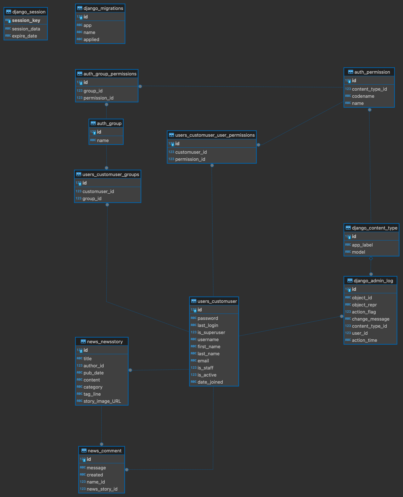

# Alisha - She Codes News Project

## About This Project
This is a news website that allows: 
 - users to read news stories
 - authors to create them

## How to Run This Code
1. Clone the repo
2. Set up a virtual environment 
    - Change directory into the repo you just cloned and create a new virtual environment using: 
    `python -m venv venv`
    - Activate the environment
        - Windows: `.venv/Scripts/activate`
        - Mac: `source venv/bin/activate`
    - Install the requirements
        `python -m pip install -r requirements.txt`
3. Make the initial migrations
    - Change directories so that you're next to the manage.py file. 
    - Make the initial migrations using `python manage.py migrate`
    - Test that this is working correctly by running the server `python manage.py runserver`

## Database Schema

## Project Features
Link to Youtube: https://youtu.be/MGAxkSUHZ5E
### Required Features:
- [X] Order stories by date
- [X] Styled "new story" form
- [X] Story images
- [X] Log-in/log-out
- [X] "Account view" page
- [X] "Create Account" page
- [X] View stories by author
- [X] "Log-in" button only visible when no user is logged in/"Log-out" buttononly visible when a user *is* logged in
- [X] "Create Story" functionality only available when user is logged in

### Additional Features:
- [X] Adding categories to stories
- [X] Adding a tag line to stories
- [X] Add the ability to update and delete stories if the authenticated user is the story author. 
- [X] The ability to add comments
